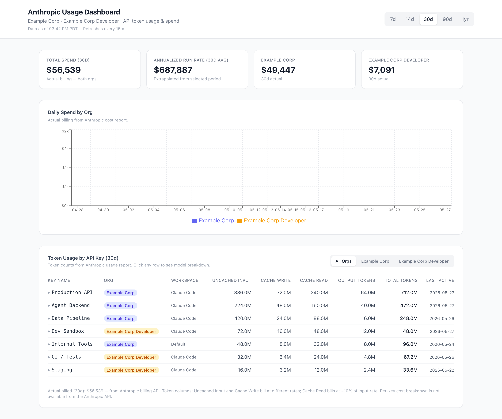

> **📦 Archived reference implementation** — built 2025–2026 while running IT solo at an HR-tech SaaS. Kept as a portfolio piece; dependencies are frozen as of archiving (August 2026). More projects: [github.com/micahyee415](https://github.com/micahyee415).

# anthropic-dashboard

> A Next.js dashboard for tracking Anthropic API usage and cost across multiple organizations.


---

## Overview

`anthropic-dashboard` is an internal-facing web app that gives engineering and finance teams a single pane of glass into Anthropic API consumption. It pulls data directly from the [Anthropic Admin API](https://docs.anthropic.com/en/api/getting-started) — no third-party billing aggregator required — and presents it as an interactive, filterable dashboard secured behind Google SSO.

The dashboard supports two named organizations (`org-primary` and `org-secondary`) and can be extended to additional orgs by adding entries to `lib/anthropic.ts`.

---

## Features

- **Multi-org view** — filter between `org-primary`, `org-secondary`, or combined "All Orgs"
- **Daily spend chart** — stacked bar chart of actual billed costs per org per day (from the Anthropic `cost_report` API)
- **Per-API-key usage table** — token breakdown (uncached input, cache write, cache read, output) sorted by total tokens; zero-usage keys are dimmed and sorted to the bottom
- **Expandable model breakdown** — click any API key row to reveal per-model token and estimated cost detail
- **Actual vs. estimated cost** — actual billed amounts from `cost_report` are shown alongside token-based estimates; the table falls back to estimates gracefully if per-key grouping is unavailable
- **Last Active column** — shows the most recent date each API key had any usage in the selected period
- **Time range selector** — 7d / 14d / 30d / 90d / 1yr; debounced to avoid burning through the Anthropic Admin API rate limit on rapid clicks
- **Stat cards** — total spend, annualized run rate, and per-org totals for the selected period
- **Google SSO** — Auth.js v5 with domain-restricted sign-in (`@example.com` only); all routes are protected except `/login` and `/api/warm`
- **Server-side caching** — Next.js `unstable_cache` with TTL scaled to date range (5 min for 7d/14d → 1 hr for 1yr); all users share cached results to minimize Admin API calls
- **Rate limit handling** — IP-based sliding-window rate limiter (10 req/min) on API routes; client shows an animated countdown ring and auto-retries
- **Cache warm endpoint** — `/api/warm` is called by a Vercel cron every 15 minutes to keep short-TTL ranges from going cold
- **Anthropic 429 handling** — respects `Retry-After` headers with exponential backoff (up to 3 retries) and graceful per-org error isolation
- **Loading skeleton** — pulse-animated placeholders while data fetches; no layout shift on load

---

## Screenshots


---

## Architecture

```
app/
├── page.tsx                    # Server component shell; wraps DashboardClient in <Suspense>
├── login/page.tsx              # Google SSO sign-in page
└── api/
    ├── auth/[...nextauth]/     # Auth.js v5 route handler
    ├── usage/route.ts          # Per-key token usage endpoint (rate-limited, cached)
    ├── cost/route.ts           # Daily cost + per-key billed cost endpoint (rate-limited, cached)
    └── warm/route.ts           # Cache warm endpoint — called by Vercel cron every 15 min

components/
├── DashboardClient.tsx         # Client root: manages time-range state, passes to DashboardData
├── DashboardData.tsx           # Fetches /api/usage + /api/cost in parallel; handles loading/error/rate-limit states
├── DashboardHeader.tsx         # Title bar + time-range pill buttons (debounced navigation)
├── DashboardShell.tsx          # Stat cards + chart + table; org filter state lives here
├── SpendChart.tsx              # Recharts stacked bar chart — daily actual costs by org
├── ModelCostChart.tsx          # Recharts stacked bar chart — daily costs by Claude model
└── KeyTable.tsx                # Sortable API-key table with expandable model breakdown rows

lib/
├── anthropic.ts                # Typed wrappers for Anthropic Admin API (usage_report, cost_report, api_keys)
│                               #   — pagination, 429 retry with backoff, per-key + per-model aggregation
├── cache.ts                    # Next.js unstable_cache wrappers with range-scaled TTLs
├── pricing.ts                  # Static pricing table for Claude models; token → USD estimation
└── ratelimit.ts                # In-memory sliding-window rate limiter (10 req / 60 s per IP)
```

**Key design decisions:**

- **Next.js App Router** — server components for the page shell; client components for all interactive UI
- **Auth.js v5 (next-auth beta)** — split config between `auth.config.ts` (edge-compatible, used by middleware) and `auth.ts` (Node.js, used by API routes and server components)
- **Anthropic Admin API** — calls `GET /organizations/usage_report/messages` (token counts grouped by API key + model + day) and `GET /organizations/cost_report` (actual billed costs grouped by day, model, or API key). Pagination is handled automatically.
- **Caching strategy** — `unstable_cache` persists across Vercel serverless invocations; cache keys use `days` (not timestamps) so all users share a single entry per range; responses are `Cache-Control: private, no-store` to prevent CDN caching of financial data
- **Rate limiting** — in-memory store is acceptable for a small internal audience; resets on cold start (irrelevant since server cache absorbs repeated requests anyway)

---

## Tech Stack

| Layer | Technology |
|-------|-----------|
| Framework | [Next.js 16](https://nextjs.org/) (App Router) |
| Language | TypeScript 5 |
| Auth | [Auth.js v5 (next-auth)](https://authjs.dev/) + Google OAuth |
| Charts | [Recharts](https://recharts.org/) |
| Styling | [Tailwind CSS v4](https://tailwindcss.com/) |
| Date utils | [date-fns](https://date-fns.org/) |
| Deploy | [Vercel](https://vercel.com/) (cron support requires Pro plan for >10s function duration) |
| API | [Anthropic Admin API](https://docs.anthropic.com/en/api/getting-started) |

---

## Getting Started

### Prerequisites

- Node.js 20+
- An [Anthropic Admin API key](https://console.anthropic.com/) for each org you want to monitor
- A Google Cloud OAuth 2.0 client (Web application type)

### Install

```bash
git clone https://github.com/micahyee415/anthropic-usage-dashboard
cd anthropic-usage-dashboard
npm install
```

### Configuration

Copy the example env file and fill in your values:

```bash
cp .env.local.example .env.local
```

| Variable | Description |
|----------|-------------|
| `ORG_PRIMARY_ADMIN_KEY` | Anthropic Admin API key for your primary org (`sk-ant-admin01-...`) |
| `ORG_SECONDARY_ADMIN_KEY` | Anthropic Admin API key for your secondary org (`sk-ant-admin01-...`) |
| `GOOGLE_CLIENT_ID` | OAuth 2.0 client ID from Google Cloud Console |
| `GOOGLE_CLIENT_SECRET` | OAuth 2.0 client secret from Google Cloud Console |
| `AUTH_SECRET` | Random secret for signing Auth.js session tokens — generate with `openssl rand -base64 32` |

**Google OAuth setup:**

1. Go to [Google Cloud Console](https://console.cloud.google.com/) → APIs & Services → Credentials
2. Create an OAuth 2.0 Client ID (Web application)
3. Add authorized redirect URIs:
   - `http://localhost:3000/api/auth/callback/google` (local dev)
   - `https://your-app.vercel.app/api/auth/callback/google` (production)

**Domain restriction:** By default, `auth.ts` restricts sign-in to `@example.com` accounts. Update the `signIn` callback in `auth.ts` to match your domain:

```ts
signIn({ profile }) {
  return profile?.email?.endsWith('@your-company.com') ?? false
},
```

**Org labels:** The display names shown in the UI ("Example Corp", "Example Corp Developer") are set in `lib/anthropic.ts` inside `getOrgs()`. Edit them to match your organization names.

### Run dev

```bash
npm run dev
```

Open [http://localhost:3000](http://localhost:3000) — you will be redirected to the Google sign-in page.

### Build

```bash
npm run build
npm start
```

### Deploy to Vercel

[](https://vercel.com/new)

1. Push the repo to GitHub and import it in Vercel
2. Add all five environment variables in the Vercel project settings
3. Set `NEXTAUTH_URL` to your production URL (e.g. `https://your-app.vercel.app`) if Auth.js requires it in your version
4. The `vercel.json` cron runs `/api/warm` every 15 minutes to pre-warm short-TTL caches — this requires a **Vercel Pro** plan (the warm endpoint uses `maxDuration: 60`)

**Note on the Anthropic Admin API rate limit:** The Admin API has strict rate limits. The dashboard is designed to stay within them: server-side caching absorbs repeated requests, the client debounces date-range switches, and background prefetch of other date ranges is intentionally disabled.

---

## License

No license file is present in this repository. All rights reserved unless otherwise stated.
